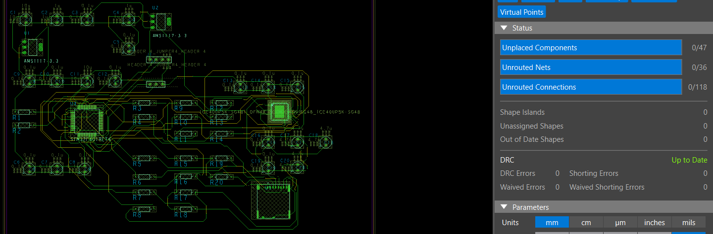

# Embedded Controller with FPGA Co-Processor

A 4-layer embedded controller integrating an STM32F401 microcontroller, Lattice iCE40 FPGA co-processor, and microSD (4-bit SDIO). The project demonstrates hardware/software partitioning, controlled-impedance PCB design, bare-metal firmware, FPGA RTL, and signal/power integrity analysis.

## Project Overview

This system is an FPGA-assisted data acquisition platform. The FPGA implements deterministic parallel data capture and buffering, while the STM32 handles system control, the synchronous MCU to FPGA interface, higher-level processing, and the microSD SDIO interface.

The project was completed as a design, firmware, RTL, and simulation portfolio project. The PCB was not fabricated, so target-board hardware functionality has not been physically validated.

### PCB Layout

*Completed PCB layout showing top and bottom routing with 0 unrouted connections and 0 DRC errors.*

## Key Features

- STM32F401 (LQFP64) – bare-metal / register-level firmware
- Lattice iCE40UP5K – Parallel Data Capture Engine (Verilog)
- 4-bit SDIO microSD interface
- 4-layer PCB with 50 Ω controlled-impedance routing target
- Multi-rail power architecture (3.3 V + 1.2 V)
- Simplified 3.3 V rail load-step analysis in PSpice
- 22 Ω source series termination and return-path-aware layout
- MCU to FPGA synchronous 4-bit interface with FPGA interrupt signaling

## Repository Structure

- [`hardware/`](hardware/) — Schematic, PCB layout, stackup, and design evidence
- [`firmware/`](firmware/) — STM32F401 bare-metal firmware
- [`fpga/`](fpga/) — Verilog RTL, self-checking testbench, and simulation results
- [`simulation/`](simulation/) — PSpice power-rail analysis and results
- [`docs/`](docs/) — System architecture and technical documentation
- [`project-management/`](project-management/) — Requirements, milestones, and project status

## Tools Used

- OrCAD Capture / PCB Editor
- OrCAD PSpice
- STM32CubeIDE (register-level)
- Icarus Verilog + GTKWave
- Git / GitHub

## Results Summary

- Completed 4-layer schematic and PCB layout with 0 unrouted connections and 0 DRC errors
- Calculated and constrained 50 Ω single-ended routing for SDIO and MCU to FPGA interfaces
- Implemented STM32 register-level UART, SDIO initialization, and MCU to FPGA interface firmware
- Implemented and verified the FPGA Parallel Data Capture Engine using a self-checking Verilog testbench
- Simulated a simplified 3.3 V rail load step in PSpice, showing approximately 36 mV of voltage droop from a 20 mA to 200 mA load transition
- Documented PCB stackup, schematics, routing, FPGA verification, and power-rail analysis

## Skills Covered

- 4-layer PCB design and stackup definition
- Controlled impedance (50 Ω microstrip) calculation and constraint setup
- Signal integrity fundamentals (return paths, source termination, and trace-length considerations)
- Multi-rail power architecture and basic power integrity analysis (PSpice)
- Schematic capture and netlist management in OrCAD
- Bare-metal / register-level STM32 firmware development
- Register-level SDIO initialization
- FPGA RTL design in Verilog
- Self-checking testbench development and simulation (Icarus Verilog + GTKWave)
- MCU to FPGA hardware/software co-design and interfacing
- Technical documentation and repository organization
